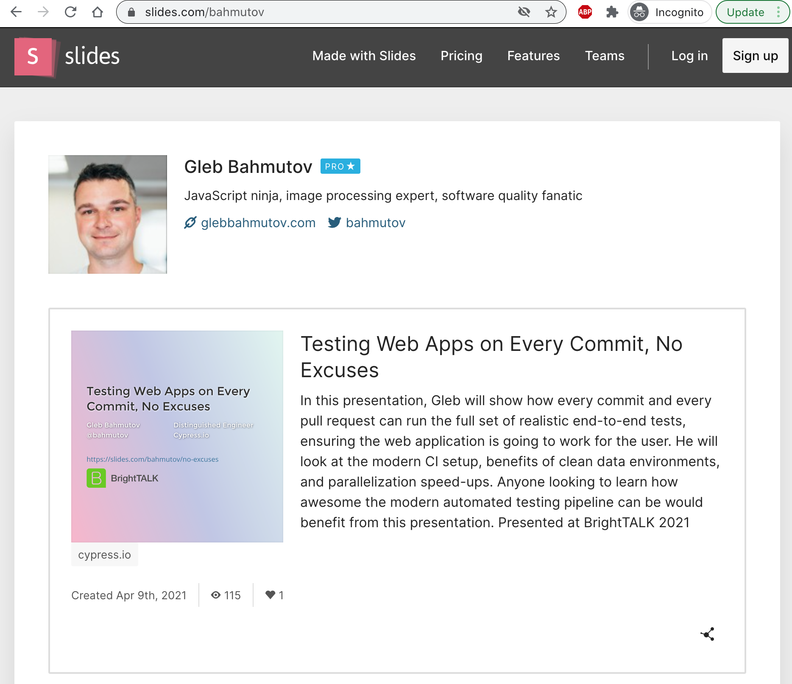

# scrape-slides
> Scrape slides.com/username to get the main deck information as a JSON list

From



To `decks.json`

```json
[
  {
    "createdAt": "2021-04-09 19:31:53 UTC",
    "description": "In this presentation, Gleb will show how every commit and every pull request can run the full set of realistic end-to-end tests, ensuring the web application is going to work for the user. He will look at the modern CI setup, benefits of clean data environments, and parallelization speed-ups. Anyone looking to learn how awesome the modern automated testing pipeline can be would benefit from this presentation. Presented at BrightTALK 2021",
    "slug": "no-excuses",
    "url": "/bahmutov/no-excuses",
    "username": "bahmutov",
    "viewCount": 115,
    "visibility": "all"
  },
  ...
]
```

Uses [Cypress Test Runner](https://github.com/cypress-io/cypress)

```
$ npm install
$ npx cypress open
```

See the [cypress/integration/spec.js](./cypress/integration/spec.js)
